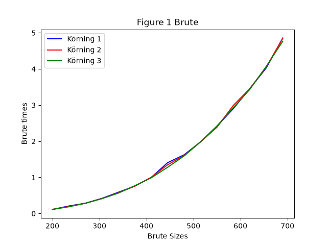
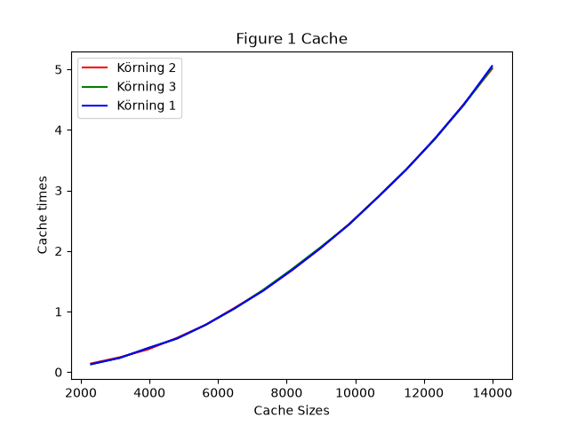
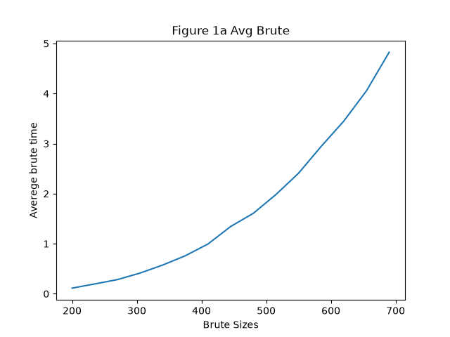
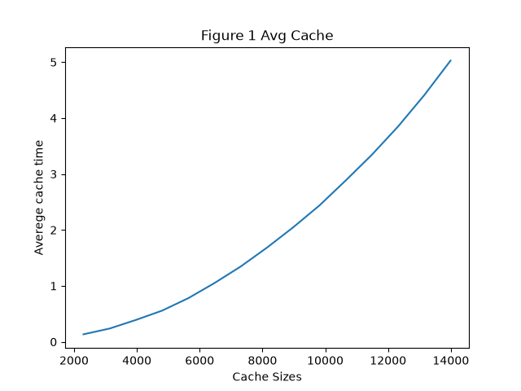
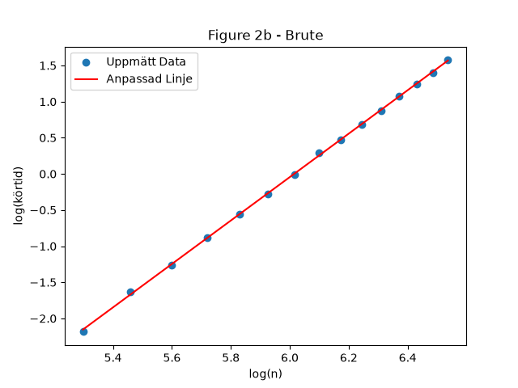
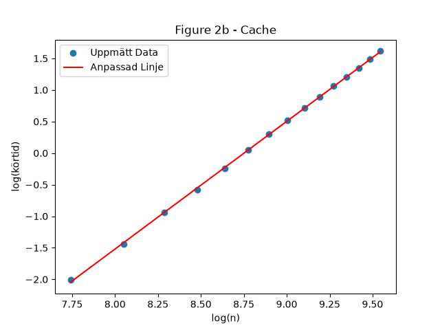
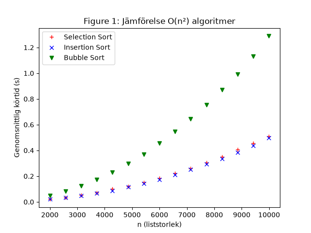
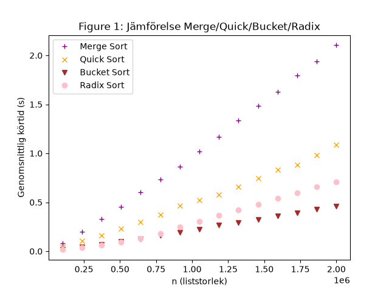
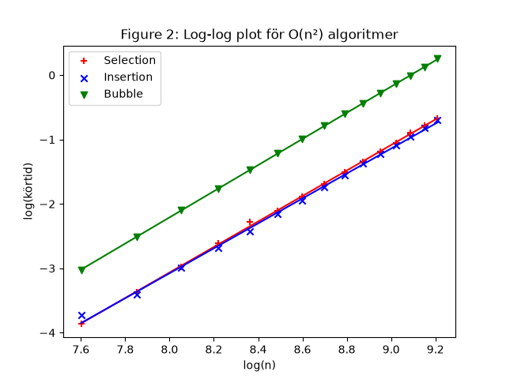
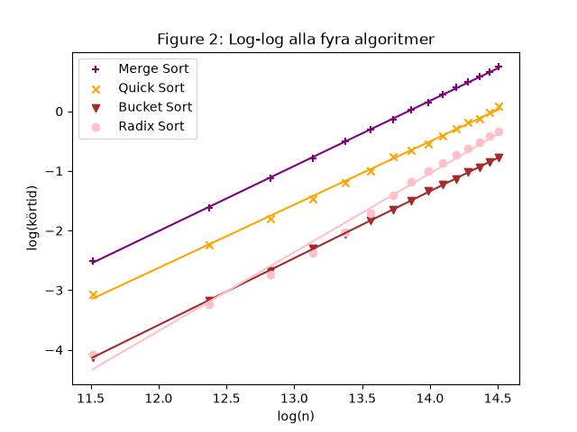

# Assignment 1 Rapport

Den här rapporten redovisar arbetet med två delar. Den första delen handlar om 3-sum problemet, det
vill säga att hitta alla unika kombinationer av tre tal i en lista som tillsammans summerar till
noll. Den andra delen handlar om att implementera och jämföra sju olika sorteringsalgoritmer. För
båda delarna har algoritmernas hastighet mätts experimentellt och sedan jämförts med den teoretiska
tidskomplexiteten, det vill säga hur mycket arbete algoritmen behöver göra när listan blir större.

## Del 1: 3-Sum

Två olika lösningar på 3-sum problemet implementerades och jämfördes: `threesum_brute`, en enkel
lösning som testar alla tänkbara kombinationer av tre tal, och `threesum_cache`, en snabbare lösning
som utnyttjar en datastruktur för att slippa testa lika många kombinationer.

### Metod

Talen i de slumpmässiga listorna genererades i intervallet `[-10n, 10n]`, enligt uppgiftens
specifikation. Ett intervall som växer med `n` behövs för att sannolikheten att hitta trippel som
summerar till noll ska hålla sig rimlig oavsett listans storlek. Om intervallet istället var fast,
till exempel alltid `[-100, 100]`, skulle en större lista bara innehålla fler dubbletter av samma få
tal, istället för fler unika värden att kombinera.

För att kunna jämföra algoritmerna rättvist mättes körtiden för flera olika liststorlekar (`n`),
från små listor till stora. Målet var att hitta liststorlekar som gav körtider mellan ungefär 0.1
och 5 sekunder, så att skillnader mellan algoritmerna syns tydligt utan att experimenten tar
orimligt lång tid att köra. Lämpliga liststorlekar hittades genom att testa sig fram manuellt:
algoritmen kördes på några olika `n`-värden, körtiden mättes, och `n` justerades sedan uppåt eller
nedåt med hjälp av algoritmens kända tidskomplexitet som riktlinje. Eftersom `threesum_cache` är
snabbare än `threesum_brute` behövde den betydligt större `n`-värden för att hamna i samma
tidsspann.

Under det här arbetet upptäckte jag att min ursprungliga kod för att undvika dubbletter, `if triple
not in sumZero`, sökte i en vanlig lista och därför gjorde att `threesum_cache` i praktiken blev
långsammare än den teoretiska O(n²) komplexiteten, eftersom listan `sumZero` växte sig stor. En
sökning i en vanlig lista blir nämligen långsammare ju fler element listan innehåller. Jag åtgärdade
det genom att lägga till en separat mängd, `seen_triples`, för själva dubblettkontrollen. En sökning
i en mängd tar ungefär lika lång tid oavsett hur många element den innehåller, vilket löste
problemet. Efter den fixen matchade båda algoritmernas uppmätta k-värden de teoretiska
förväntningarna väl.

Varje `n`-värde testades 3 gånger för att kunna se om körtiderna varierade mellan körningar, vilket
visas i Figure 1. Medelvärdet av de här 3 körningarna användes sedan för den fortsatta analysen i
Figure 1a och 2b.

### Resultat och jämförelse

I Figure 1 ligger de tre körningarna nära varandra för både `threesum_brute` och `threesum_cache`,
vilket visar att mätningarna är stabila och konsekventa mellan olika körningar, och inte bara beror
på slumpen i just den enskilda körningen.

I Figure 1a syns tydligt att körtiden böjer uppåt när `n` växer, det vill säga körtiden ökar
snabbare och snabbare ju större listan blir, inte i en rak linje. Det är väntat för algoritmer med
polynomisk tidskomplexitet, det vill säga algoritmer vars antal beräkningssteg växer som `n` upphöjt
till någon exponent.

I Figure 2b bekräftas det här av lin_reg analysen. `threesum_brute` fick k ≈ 3 och `threesum_cache`
fick k ≈ 2. K värdet motsvarar exponenten i algoritmens tidskomplexitet, eftersom körtiden växer
ungefär som t = C · n^k, där C är en konstant. Det stämmer väl överens med att `threesum_brute` har
tre nästlade loopar och alltså tidskomplexiteten O(n³), medan `threesum_cache` bara har två loopar,
eftersom den tredje loopen ersätts av en snabb mängduppslagning och därför får tidskomplexiteten
O(n²). Ett lägre k-värde betyder alltså att algoritmen skalar bättre när listan blir större.

### Matematisk bakgrund

Om en algoritm har tidskomplexitet O(n^k), följer körtiden ungefär formeln t = C · n^k, där C är
någon konstant och k är exponenten man vill ta reda på. Den formeln beskriver en kurva, inte en rät
linje, och linjär regression kan bara hitta räta linjer, så metoden går inte att använda direkt på
de rådata man mäter.

Lösningen är att ta logaritmen av båda sidor av ekvationen. Med hjälp av logaritmreglerna log(a·b) =
log(a) + log(b) och log(a^k) = k · log(a) blir ekvationen istället log(t) = log(C) + k · log(n). Den
ekvationen har formen y = m + k · x, som är formeln för en rät linje. Sätter man x = log(n) och y =
log(t) blir sambandet mellan dem rakt istället för böjt, och lutningen på den räta linjen är exakt
samma k som i den ursprungliga n^k formeln. Det är därför graferna i Figure 2b visar log(n) på x
axeln och log(körtid) på y axeln, istället för de vanliga värdena.

Funktionen `lin_reg` använder minsta kvadratmetoden för att hitta de m och k värden som gör att
linjen y = m + k · x passar de uppmätta punkterna så bra som möjligt, det vill säga den linje som
ligger så nära alla punkterna som möjligt. Här är k lutningen på linjen, och det är den som
motsvarar exponenten i tidskomplexiteten. m är istället var linjen skär y axeln, vilket motsvarar
log(C), en konstant som inte säger något om själva komplexiteten och därför inte är lika intressant.

### Hur cache lösningen fungerar

`threesum_cache` bygger på tanken att man kan räkna ut exakt vilket tal som behövs för att summan
ska bli noll, istället för att som i brute force leta efter det med en tredje loop som testar alla
möjligheter.

Algoritmen har två loopar, `i` och `j`, precis som brute force. Men för varje par `lst[i]` och
`lst[j]` räknas det tredje talet som skulle behövas ut direkt, med `needed = sum - lst[i] - lst[j]`.
Sedan kollas om `needed` faktiskt finns någonstans i listan, genom att titta i en mängd som kallas
`seen`. Den mängden innehåller alla tal som `j` loopen redan gått igenom tidigare för det aktuella
`i`.

Eftersom `seen` är en mängd och inte en vanlig lista går kollen `needed in seen` snabbt, ungefär
lika snabbt oavsett hur många tal som redan lagts till i mängden. Det är den snabba kollen som
ersätter den tredje loopen från brute force, och som gör att algoritmen bara behöver ungefär n²
operationer istället för n³.

`seen` byggs upp gradvis medan loopen körs. Den börjar tom för varje nytt värde på `i`, och efter
att `j` kollat ett tal läggs det talet till i `seen`, så att senare tal i listan kan hitta det som
ett möjligt tredje tal om det behövs.

## Del 2: Sorteringsalgoritmer

I den här delen implementerades sju sorteringsalgoritmer, uppdelade efter deras tidskomplexitet:
selection sort, bubble sort och insertion sort med O(n²), merge sort och quick sort med O(n log n),
samt bucket sort och radix sort, två specialfallsalgoritmer som under rätt förutsättningar kan vara
ännu snabbare.

### Metod

Talen i listorna genererades slumpmässigt i intervallet 2000 till 10000. Här spelar det valda
talintervallet mindre roll än i 3-sum delen, eftersom en sorteringsalgoritms körtid bara beror på
hur många element listan innehåller, inte på vilka specifika värden talen har.

Experimenten delades upp i två grupper, eftersom algoritmerna skiljer sig kraftigt i hastighet.
Selection, bubble och insertion sort testades med `n` mellan 2000 och 10000, samma spann som
uppgiftens eget exempel använder. Merge sort, quick sort, bucket sort och radix sort testades
istället med mycket större `n`, mellan 100000 och 2000000, eftersom O(n log n) växer betydligt
långsammare än O(n²), och de behövde alltså mycket större listor för att körtiderna skulle hamna i
ett mätbart intervall. Med samma små `n` som för de långsammare algoritmerna hade körtiderna blivit
alldeles för korta för att ge en tydlig och tillförlitlig trend.

Varje `n`-värde testades 3 gånger, precis som i del 1, och medelvärdet av dessa körningar användes
för den fortsatta analysen.

### Resultat och jämförelse

Bland de tre O(n²) algoritmerna var selection sort och insertion sort ungefär lika snabba och klart
snabbast, medan bubble sort var betydligt långsammare än de andra två.

Bland merge sort, quick sort, bucket sort och radix sort var merge sort långsammast, följt av quick
sort. Bucket sort och radix sort var snabbast av de fyra, med bucket sort något snabbare än radix
sort.

Detta bekräftades av lin_reg analysen. Selection, bubble och insertion sort fick alla k värden nära
2, vilket stämmer med att de har två nästlade loopar och tidskomplexiteten O(n²). Merge sort och
quick sort fick k värden nära 1, liksom bucket sort, vilket stämmer med tidskomplexiteten O(n log n)
för de förstnämnda, eftersom log(n) växer så pass långsamt att kurvan nästan ser rak ut på den här
skalan och därför liknar en linjär funktion. Radix sort fick ett k värde något högre än de andra
tre, men fortfarande betydligt närmare 1 än 2.

### Matematisk bakgrund

Samma metod som i del 1 användes här för att uppskatta tidskomplexiteten. Logaritmen togs av både
liststorleken `n` och den uppmätta körtiden, vilket gör sambandet mellan dem rakt istället för böjt.
Lin_reg användes sedan för att hitta den räta linjens lutning, k, som motsvarar exponenten i
algoritmens tidskomplexitet. En fullständig förklaring av varför den här metoden fungerar finns
under Del 1, Matematisk bakgrund.

### Hur algoritmerna fungerar

**Selection sort** går igenom den osorterade delen av listan om och om igen och letar reda på det
minsta talet varje gång. Det görs genom att gå igenom talen ett efter ett och hela tiden komma ihåg
vilket det minsta talet är hittills, samt var i listan det ligger. När hela den osorterade delen har
gåtts igenom byts det minsta talet till den första lediga platsen i listan. På så sätt växer den
sorterade delen av listan med ett element i taget, från vänster till höger, medan den osorterade
delen krymper i motsvarande takt, tills hela listan är sorterad. Eftersom algoritmen alltid måste gå
igenom hela den kvarvarande osorterade delen för att hitta det minsta talet, även om listan redan
råkar vara nästan sorterad, ger den ingen fördel av data som redan ligger nära rätt ordning.

**Bubble sort** jämför varje par av grannar i listan och byter plats på dem om de står i fel
ordning, det vill säga om det vänstra talet är större än det högra. Namnet kommer av att de största
talen gradvis flyttar sig, eller bubblar, mot slutet av listan medan de mindre talen sjunker neråt
mot början. Efter en hel genomgång av listan har det största talet flyttat sig hela vägen till
slutet. Genom att upprepa den här genomgången flera gånger, och varje gång göra rundan en aning
kortare eftersom slutet redan är klart och inte behöver kollas igen, sorteras till slut hela listan.
I den implementation som används här avbryts algoritmen dessutom tidigt om en hel runda går igenom
utan att något byte behövde göras, eftersom det då betyder att listan redan är sorterad.

**Insertion sort** bygger upp en sorterad del av listan ett tal i taget, ungefär som att sortera
spelkort i handen medan man delas ut korten ett i taget. Det första talet i listan räknas som en
färdig, sorterad hög på ett enda kort. Varje efterföljande tal jämförs sedan med talen i den redan
sorterade delen, från höger till vänster, och flyttas in på rätt plats genom att större tal skjuts
ett steg åt höger för att göra plats åt det nya talet. Om listan redan är nästan sorterad behöver
varje nytt tal bara flyttas en kort sträcka, vilket gör att insertion sort ofta är snabbare i
praktiken än vad man skulle tro utifrån dess tidskomplexitet.

**Merge sort** delar listan i två ungefär lika stora halvor, sorterar varje halva rekursivt genom
att anropa sig själv på varje halva, och slår sedan ihop de två redan sorterade halvorna till en
enda sorterad lista. Delningen fortsätter tills varje del bara innehåller ett enda tal, eftersom en
lista med ett tal alltid räknas som sorterad. Ihopslagningen görs genom att hela tiden jämföra det
första kvarvarande talet i respektive halva och plocka det minsta av de två, tills båda halvorna är
tomma och alla tal har flyttats över till den nya, sorterade listan. Eftersom listan alltid delas i
mitten oavsett hur talen ser ut tar merge sort ungefär lika lång tid varje gång, till skillnad från
till exempel quick sort.

**Quick sort** väljer ut ett tal i listan, kallat pivot, och delar sedan resten av talen i tre
grupper: en med tal som är mindre än pivot, en med tal som är lika med pivot, och en med tal som är
större än pivot. De två yttre grupperna sorteras sedan rekursivt på samma sätt, det vill säga genom
att välja en ny pivot i varje grupp och dela upp den ytterligare, och resultatet sätts till slut
ihop i rätt ordning: den sorterade mindre gruppen, följt av gruppen med tal lika med pivot, följt av
den sorterade större gruppen. Hur snabb quick sort blir beror på hur bra pivotvalet är. Om pivoten
råkar dela listan i två ungefär lika stora delar varje gång blir algoritmen mycket snabb, men om
pivoten till exempel alltid råkar bli det minsta eller största talet blir den betydligt långsammare.

**Bucket sort** delar upp talen i ett antal hinkar utifrån deras ungefärliga värde, till exempel så
att låga tal hamnar i tidiga hinkar och höga tal i sena hinkar. Vilken hink ett tal hamnar i räknas
ut utifrån var i det totala talintervallet talet ligger, jämfört med det minsta och största talet i
listan. Varje hink sorteras sedan för sig med en enklare metod, och hinkarna slås därefter ihop i
ordning, från den första till den sista, till en färdig, sorterad lista. Bucket sort fungerar
särskilt bra när talen är jämnt utspridda över hela intervallet, eftersom varje hink då får ungefär
lika många tal och blir snabb att sortera.

**Radix sort** sorterar talen en siffra i taget, med start på entalssiffran. För varje siffra
placeras talen i tio hinkar, en för varje siffra 0 till 9, utifrån just den siffrans värde. Hinkarna
slås sedan ihop igen i ordning, och hela processen upprepas för nästa siffra, alltså tiotalssiffran,
sedan hundratalssiffran, och så vidare, tills alla siffror i det största talet i listan har använts.
Eftersom varje omgång bara tittar på en enda siffra, och antalet siffror i talen inte beror på hur
många tal listan innehåller, kan radix sort under rätt förutsättningar sortera nästan lika snabbt
som bucket sort.